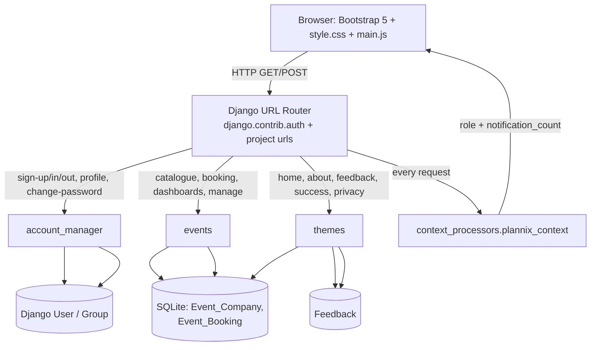
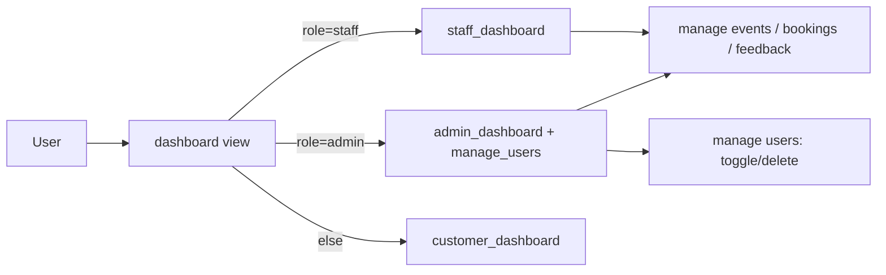

# Plannix — Project Workflow

> Source-of-truth documentation generated by inspecting the Plannix codebase.
> Every file path, function, and class name below was read directly from the
> source. No features are invented; where something is **not** implemented, that
> is stated explicitly.

Plannix is a Django 6.0 event-planning & booking web application. It lets
customers browse event packages, book them, and track bookings, while staff and
admins manage the catalogue, process bookings, and moderate users/feedback.

---

## 1. Purpose and Main Features

**Purpose:** a premium event booking platform — vendors list event packages
(`Event_Company`), customers book them for a date (`Event_Booking`), and
staff/admins operate the lifecycle.

**Main features (all confirmed in code):**

| Feature | Where it lives |
| ------- | -------------- |
| Public event catalogue + type filter + keyword search | `events/views.py :: events`, `searching_events`; `events/urls.py` |
| Event detail page | `events/views.py :: readmore` |
| Online booking with server-side validation | `events/views.py :: selected_event`, `event_booking` |
| Role-aware dashboards (customer / staff / admin) | `events/views.py :: dashboard`, `customer_dashboard`, `staff_dashboard`, `admin_dashboard` |
| Customer booking management (view + cancel own) | `events/views.py :: my_bookings`, `cancel_booking` |
| Event package CRUD (staff/admin) | `events/views.py :: add_event`, `edit_event`, `delete_event`, `manage_events` |
| Booking management (status update + delete, staff/admin) | `events/views.py :: manage_bookings`, `update_booking_status`, `delete_booking` |
| Feedback submission + moderation (staff/admin) | `themes/views.py :: feedback`; `events/views.py :: manage_feedback`, `delete_feedback` |
| User management (activate/deactivate + delete, admin only) | `events/views.py :: manage_users`, `toggle_user_active`, `delete_user` |
| Authentication (sign-up/in/out, profile, password change) | `account_manager/views.py` |
| Custom 404 / 403 / 500 pages | `events/views.py :: error_404`, `error_403`, `error_500` |
| Branded Django admin (Jazzmin) | `Plannix/settings.py :: JAZZMIN_SETTINGS`; `events/admin.py`, `themes/admin.py` |
| Seeded demo dataset | `events/management/commands/seed_demo.py` |
| Public marketing pages (home, about, privacy) | `themes/views.py` |

**NOT implemented (explicit, since the brief asked):**

- **Scheduling workflow** — there is no calendar, availability view, or
  recurring-event logic. A booking is just a `event_booking_date` string
  (`CharField`, `YYYY-MM-DD`). Conflict detection is a simple per-type date
  uniqueness check (`event_booking` view).
- **Budget management** — no budget model, totals tracking, or spend limits.
  There is only a derived `total_spent`/`revenue` aggregate over
  `event_price` in dashboards (read-only sums).
- **Theme/customization workflow** — the `themes/` app is **not** a theming
  system. It holds the `Feedback` model and the public pages. Visual theming is
  static CSS (`static/css/style.css`) with design tokens in `:root`; there is no
  per-user or per-event theming UI or model.
- **Public REST API / DRF** — none. All interactions are server-rendered
  Django templates + standard `POST` form submissions. `main.js` uses no
  `fetch`/AJAX for data — only toasts, animation, sidebar, and `window.confirm`.

---

## 2. Project Structure and Important Files

```text
plannix/
├── manage.py                         # Django entrypoint
├── requirements.txt                  # Pinned deps (Django 6.0.1, etc.)
├── .env                              # Local secrets (never committed; read by settings)
├── README.md, product.md, LICENSE
│
├── Plannix/                          # Project config package
│   ├── settings.py                   # Apps, middleware, auth, email, jazzmin, security
│   ├── urls.py                       # Root routing + error handlers
│   ├── context_processors.py         # plannix_context (role + notification count)
│   ├── asgi.py / wsgi.py
│
├── account_manager/                  # Auth & profile (no models.py of its own)
│   ├── views.py                      # sign_up, sign_in, sign_out, profile, change_password
│   ├── urls.py  decorators.py        # RBAC helpers (get_role, admin_only, staff_or_admin…)
│   ├── tests.py  admin.py  apps.py  models.py (empty)
│
├── events/                           # Core business module
│   ├── models.py                     # Event_Company, Event_Booking
│   ├── views.py                      # Catalogue, booking, dashboards, management
│   ├── urls.py  admin.py  tests.py  apps.py
│   └── management/commands/seed_demo.py
│
├── themes/                           # Public pages + feedback model
│   ├── models.py                     # Feedback
│   ├── views.py                      # index, about, feedback, success, error, privacy_policy
│   ├── urls.py  admin.py  apps.py  tests.py
│   └── templatetags/plannix_filters.py   # get_item template filter
│
├── templates/                        # All HTML (base.html, dashboards, forms, error pages)
├── static/                           # css/style.css (design system), js/main.js, lib/, img/, icon/
├── media/events/                     # Uploaded/copied event images (MEDIA_ROOT)
├── event_images/<category>/          # Seed source images (birthday, catering, corperate, dj, wedding)
├── screenshots/                      # README media
└── scripts/                          # capture_screenshots.py, generate_assets.py
```

**Config notes from `Plannix/settings.py`:**

- `INSTALLED_APPS`: `jazzmin`, Django contrib, `themes`, `events`, `account_manager`.
- `DATABASES`: SQLite3 at `db.sqlite3`.
- `TIME_ZONE = 'Asia/Kolkata'`, `USE_TZ = True`.
- `LOGIN_URL = 'sign_in'`.
- `EMAIL_BACKEND = 'django.core.mail.backends.console.EmailBackend'` (mail prints to console in dev).
- Session timeout: `django_session_timeout` — 1800s, expiry after last activity, invalid on browser close, redirect to `sign_in`.
- Jazzmin UI is branded via `JAZZMIN_SETTINGS` / `JAZZMIN_UI_TWEAKS`.

---

## 3. Architecture and Complete Data Flow



**Request lifecycle:**

1. Request hits `Plannix/urls.py`. Three app `include()` blocks mount routes
   under the same root; the Django admin is at `core-admin/`.
2. `Plannix/context_processors.py :: plannix_context` runs on every rendered
   template, injecting `site_name`, `user_role` (via `get_role`), and
   `notification_count`.
3. Views apply `login_required(login_url='sign_in')` and role decorators
   (`admin_only`, `staff_or_admin`). Guarded views redirect to `dashboard` on
   failure, with a Django `messages.error`.
4. Views query `Event_Company` / `Event_Booking` / `Feedback` / `User` and
   render templates from `templates/`.
5. On state changes, email helpers (`send_booking_email`, `send_status_email`)
   fire through the console email backend.
6. `messages` are serialized into `window.PLANNIX_MESSAGES` in `base.html` and
   rendered as toasts by `static/js/main.js`.

---

## 4. Event Creation / Management Workflow

**Event package = `Event_Company`** (a vendor's event offering). Managed by
staff/admin only.

- **List:** `events/views.py :: manage_events` → `templates/manage_events.html`.
- **Add:** `events/views.py :: add_event` (POST) → `_event_from_post` builds the
  object → `templates/event_form.html`.
- **Edit:** `events/views.py :: edit_event` → same form, pre-filled.
- **Delete:** `events/views.py :: delete_event` (POST only).
- **Validation (`_event_from_post`):** requires `event_name`, `event_type`,
  `event_price`, `event_description`, `location`; `event_price` must be a digit
  (cast to `int`).
- **Image:** `event_img` is an `ImageField(upload_to='events')`; on add/update,
  `request.FILES['event_img']` is attached if present.
- **Packages:** four fixed `CharField`s — `package1..package4`.
- **Admin:** `events/admin.py :: Event_CompanyAdmin` registers with
  fieldsets (package group, meta group) and `created_at` read-only.

**Seed source:** `seed_demo.py :: _events` upserts 20 packages (5 categories ×
4 events) by unique `event_name`, attaching exactly one image copied from
`event_images/<category>/` into `media/events/`.

---

## 5. Scheduling Workflow

**There is no dedicated scheduling subsystem.** What exists:

- `Event_Booking.event_booking_date` is a `CharField(max_length=10)` holding an
  ISO `YYYY-MM-DD` string (not a `DateField`).
- A booking is created via `events/views.py :: event_booking`, which validates:
  - parsed via `datetime.strptime(..., '%Y-%m-%d')`;
  - must not be in the past (`selected_date < date.today()`);
  - mobile must be 10 digits;
  - **conflict rule:** no other *non-cancelled* booking may exist for the same
    `event_booking_date` **and** `event_type`
    (`Event_Booking.objects.filter(event_booking_date=…, event_type=…).exclude(status='cancelled')`).
- "Upcoming" is computed in views/dashboards by string comparison
  (`b.event_booking_date >= date.today().isoformat()`) — not a true date query,
  and therefore order/locale-fragile.
- A true calendar/availability view is listed in README "Future Improvements"
  and is **not** present in code.

---

## 6. Budget Management Workflow

**Not implemented.** There is no budget model, allocation, or limit. The only
money-related functionality is derived aggregation in dashboards:

- `customer_dashboard`: `total_spent = bookings.filter(status__in=['confirmed','completed']).aggregate(Sum('event_price'))`.
- `staff_dashboard` / `admin_dashboard`: same aggregate labelled as revenue.
- `index` (home): `confirmed_revenue` over confirmed/completed bookings.

`event_price` is a `BigIntegerField` stored per package and copied onto each
booking at creation time. There is no payment/topup/balance logic.

---

## 7. Theme / Customization Workflow

**Not implemented as a feature.** Clarification:

- The `themes/` Django app is the *public-site* app (home/about/feedback) plus
  the `Feedback` model. It is not a theming engine.
- Visual design is a **static** design system in `static/css/style.css`
  (CSS custom properties under `:root`, e.g. `--px-brand`, `--px-dark`,
  `--px-font-display`) and Bootstrap 5. There is no per-tenant, per-user, or
  per-event theming model, admin, or form.
- `JAZZMIN_UI_TWEAKS` in settings only re-skins the Django admin; it is not
  user-facing event theming.

---

## 8. Admin / Event-Manager Workflow

Three roles are derived in `account_manager/decorators.py :: get_role`:

- `admin` — superuser **or** member of Group `admin`.
- `staff` — member of Group `staff`.
- `customer` — any authenticated user with neither group.
- `anonymous` — not authenticated.



**Staff (role=staff or admin)** — `staff_or_admin` decorator:

- `staff_dashboard`: counts of events, bookings, pending, upcoming, feedback.
- `manage_events`, `add_event`, `edit_event`, `delete_event`.
- `manage_bookings`, `update_booking_status`, `delete_booking`.
- `manage_feedback`, `delete_feedback`.

**Admin (role=admin only)** — `admin_only` decorator:

- `admin_dashboard`: users, staff count, events, bookings, per-status counts,
  revenue, per-type event counts, recent bookings/feedback.
- `manage_users`, `toggle_user_active`, `delete_user` (with self/superuser
  guards — cannot deactivate or delete self or a superuser).
- Access to the Django admin at `/core-admin/` (superuser required).

**Customer:**

- `customer_dashboard` (upcoming, total, spent, recent), `my_bookings`,
  `cancel_booking` (own bookings only; not if completed/cancelled).

Decorators `admin_only` and `staff_or_admin` are implemented via
`allowed_roles(...)`. On denial they `messages.error` and `redirect('dashboard')`.
`unauthenticated_user` keeps logged-in users off sign-in/sign-up.

---

## 9. Backend URLs, Views, Models, and Important Functions

### URL map (`Plannix/urls.py` includes the three apps + admin)

**account_manager (`account_manager/urls.py`)**

| Route | View | Function |
| ----- | ---- | -------- |
| `/sign-up` | `sign_up` | register (`create_user`, email on success) |
| `/sign-in` | `sign_in` | `authenticate` + `login` → `dashboard` |
| `/sign-out` | `sign_out` | `logout` |
| `/profile` | `profile` | edit first/last name + email (unique check) |
| `/change-password` | `change_password` | `PasswordChangeForm`, `update_session_auth_hash` |

**themes (`themes/urls.py`)**

| Route | View | Function |
| ----- | ---- | -------- |
| `/` | `index` | home stats + featured events |
| `/about` | `about` | static |
| `/feedback` | `feedback` | create `Feedback` + email |
| `/success`, `/error`, `/privacy-policy` | `success`, `error`, `privacy_policy` | static |

**events (`events/urls.py`)**

| Route | View | Access |
| ----- | ---- | ------ |
| `/events` | `events` | public |
| `/readmore/<pk>` | `readmore` | public |
| `/search` | `searching_events` | public |
| `/event-booking-form/<pk>` | `selected_event` | login |
| `/event-booking-form` | `event_booking` | login |
| `/dashboard` | `dashboard` | login (role redirect) |
| `/customer-dashboard` | `customer_dashboard` | login |
| `/staff-dashboard` | `staff_dashboard` | staff+admin |
| `/admin-dashboard` | `admin_dashboard` | admin |
| `/my-bookings` | `my_bookings` | login |
| `/cancel-booking/<pk>` | `cancel_booking` | login (own) |
| `/manage/events` …/add …/edit/<pk> …/delete/<pk> | `manage_events`,`add_event`,`edit_event`,`delete_event` | staff+admin |
| `/manage/bookings` …/<pk>/status …/delete/<pk> | `manage_bookings`,`update_booking_status`,`delete_booking` | staff+admin |
| `/manage/feedback` …/delete/<pk> | `manage_feedback`,`delete_feedback` | staff+admin |
| `/manage/users` …/<pk>/toggle …/delete/<pk> | `manage_users`,`toggle_user_active`,`delete_user` | admin |

**Important functions (events/views.py):**

- `send_booking_email(booking)`, `send_status_email(booking)` — console email.
- `events(request)` — catalogue with `?type=` filter.
- `searching_events(request)` — `Q()` over name/type/price/location.
- `event_booking(request)` — the validated booking create path.
- `_event_from_post(request, event=None)` — shared event create/update parser.
- `dashboard(request)` — role router.
- `customer_dashboard`, `staff_dashboard`, `admin_dashboard` — stats views.
- `cancel_booking`, `manage_*` suite, `update_booking_status`.
- `error_404/403/500` — wired as `handler404/403/500` in root urls.

---

## 10. Frontend / Templates / Forms / API Interactions

**Templates (in `templates/`):**

- `base.html` — navbar, `window.PLANNIX_MESSAGES` injection, asset links.
- `dashboard_base.html` — sidebar layout for role dashboards.
- `auth_base.html` — sign-in/sign-up shell.
- Public: `index.html`, `events.html`, `readmore.html`, `search.html`,
  `about.html`, `feedback.html`, `privacy-policy.html`, `success.html`,
  `error.html`.
- Forms: `event-booking-form.html`, `event_form.html`, `sign-in.html`,
  `sign-up.html`, `profile.html`, `change-password.html`.
- Dashboards: `customer_dashboard.html`, `staff_dashboard.html`,
  `admin_dashboard.html`.
- Management: `manage_events.html`, `manage_bookings.html`,
  `manage_feedback.html`, `manage_users.html`.
- Errors: `403.html`, `404.html`, `500.html`.

**Forms:** there are **no Django `Form`/`ModelForm` classes** for the core
flows. All inputs are raw `<input>`/`<select>` in templates posted as
`request.POST` and parsed manually in views (e.g. `event_booking`,
`_event_from_post`, `sign_up`). The only framework form used is Django's
`PasswordChangeForm` in `change_password`.

**Anti-CSRF / UX:** every POST form includes ``. Destructive
actions (delete buttons) carry `data-confirm="…"`; `main.js :: initConfirmLinks`
intercepts with `window.confirm`.

**JS (`static/js/main.js`):** vanilla, no build step — scroll reveal
(IntersectionObserver), navbar state, back-to-top, toast system fed by
`window.PLANNIX_MESSAGES`, animated counters (`data-counter`), dashboard
sidebar toggle (mobile overlay), active-nav highlight. **No AJAX/fetch** — all
data mutations are full-page form POSTs.

**Templatetags:** `themes/templatetags/plannix_filters.py :: get_item` — safe
dict lookup for `type_counts|get_item:event_type`.

**Context:** `Plannix/context_processors.py :: plannix_context` provides
`site_name`, `user_role`, `notification_count` to all templates.

---

## 11. Database Models and Relationships

Three Django apps contribute models. `account_manager` has **no** models
(uses `django.contrib.auth` `User` / `Group`).

```mermaid
erDiagram
    AUTH_USER ||--o{ EVENT_BOOKING : "bookings (FK, SET_NULL)"
    EVENT_COMPANY ||--o{ EVENT_BOOKING : "referenced by name/type/price (denormalized)"
    AUTH_USER ||--o{ FEEDBACK : submits
    AUTH_GROUP }o--o{ AUTH_USER : membership

    AUTH_USER {
        string username
        string email
        bool is_superuser
        bool is_staff
    }
    EVENT_COMPANY {
        int id PK
        string event_name
        string event_type
        bigint event_price
        text event_description
        string event_mobile_number
        string package1..package4
        string location
        image event_img
        datetime created_at
    }
    EVENT_BOOKING {
        int id PK
        int user FK null
        string status "pending|confirmed|completed|cancelled"
        string name
        string email
        string number
        string event_company_name
        string event_type
        bigint event_price
        string event_booking_date "YYYY-MM-DD"
        string event_location
        string event_mobile_number
        datetime created_at
    }
    FEEDBACK {
        int id PK
        string name
        string email
        string number
        text message
        datetime created_at
    }
```

**Key relationship notes (read from the code, not assumed):**

- `Event_Booking.user` → `AUTH_USER_MODEL`, `null=True, blank=True`,
  `on_delete=SET_NULL`, `related_name='bookings'`. Bookings can therefore be
  **orphaned** (user deleted → booking kept, `user` NULL).
- **No foreign key** from `Event_Booking` to `Event_Company`. Bookings
  denormalize the package's name/type/price/location/mobile as plain
  `CharField`/`BigIntegerField` copies at creation time. `event_id` is only a
  hidden form field used to re-render the booking form on validation failure —
  it is never persisted.
- `Feedback` is independent of bookings/users (just name/email/number/message).
- `Event_Company` is the catalogue entity; `package1..4` are free-text
  inclusions.
- Migrations: `events` has 0001→0008 (added image fields, status, user FK,
  timestamps); `themes` has 0001→0002 (feedback `created_at`).

---

## 12. Authentication / Authorization

- **Auth backend:** Django's built-in `django.contrib.auth`.
- **Views:** `account_manager/views.py` — `sign_up`, `sign_in`, `sign_out`,
  `profile`, `change_password`.
- **Passwords:** created via `User.objects.create_user` (Django hashing);
  sign-up applies duplicate username/email and password-match checks plus
  Django's `AUTH_PASSWORD_VALIDATORS` (length, common, numeric, similarity).
- **Login:** `authenticate` + `login`; success redirects to `dashboard`.
- **Session security:** `django_session_timeout` middleware — 1800s idle
  expiry, `SESSION_EXPIRE_AT_BROWSER_CLOSE = True`, redirect to `sign_in`.
- **Authorization model (deny-by-default):**
  - `login_required(login_url='sign_in')` on every protected view.
  - Role decorators in `account_manager/decorators.py`:
    - `get_role(user)` → `admin`/`staff`/`customer`/`anonymous`.
    - `admin_only` → `allowed_roles(['admin'])`.
    - `staff_or_admin` → `allowed_roles(['staff','admin'])`.
    - `unauthenticated_user` → bounces logged-in users away from auth pages.
  - Object-level checks: `cancel_booking` filters `user=request.user` and
    returns 404 for others; `toggle_user_active`/`delete_user` forbid
    self/superuser.
- **CSRF:** `CsrfViewMiddleware` active; all POST forms emit ``.
- **Admin:** superuser-only via `core-admin/` (Jazzmin-branded).
- **Settings flags:** `SESSION_COOKIE_SECURE`, `CSRF_COOKIE_SECURE`,
  `SECURE_SSL_REDIRECT` default `False` (dev). HSTS set to 1 year but
  `SECURE_HSTS_PRELOAD`/`INCLUDE_SUBDOMAINS` off. `XFrameOptionsMiddleware`
  present (clickjacking).

---

## 13. Tests

Two test modules (Django `TestCase`, `Client(SERVER_NAME='localhost')` because
`ALLOWED_HOSTS` rejects `testserver`):

- **`account_manager/tests.py`** (≈21 tests):
  - `SignUpTests` — render, create+redirect, missing fields, duplicate
    username/email, password mismatch, authenticated redirect.
  - `SignInTests` — render, success→dashboard, wrong password, authenticated
    redirect.
  - `SignOutTests` — logout clears session, requires login.
  - `ProfileTests` — requires login, render, update, email required, unique
    email.
  - `PasswordChangeTests` — render, success, wrong old password.

- **`events/tests.py`** (≈48 tests):
  - `PublicCatalogueTests` — index, events list, type filter, readmore (200 +
    404), search (name / no-results / blank), about.
  - `BookingFlowTests` — form requires login, renders, create success→success
    page + `status='pending'`, rejects past date, invalid number, date
    conflict, missing fields.
  - `CustomerDashboardTests` — dashboard redirect, login required, render,
    my-bookings scoping (own only), cancel, completed-can't-cancel, can't
    cancel others' (404).
  - `StaffManagementTests` — staff dashboard render, customer blocked, manage
    events CRUD, status filter, update status (valid + unknown rejected),
    delete booking, feedback render + delete.
  - `AdminManagementTests` — admin dashboard render, staff blocked, manage
    users render, toggle active (on/off), can't deactivate self, delete user,
    can't delete self.
  - `ErrorPageTests` — 404/403/500 handlers render.

Run commands (see §14). No `themes/tests.py` coverage (file exists, empty).

---

## 14. Configuration and Exact Setup / Run Commands

**Environment variables (read in `Plannix/settings.py` via `django-environ`,
from `.env`; values are NOT in code):**

| Variable | Used for |
| -------- | -------- |
| `SECRET_KEY` | Django secret |
| `DEBUG` | bool (default `False`) |
| `ALLOWED_HOSTS` | comma list (default `127.0.0.1,localhost`) |
| `EMAIL_HOST` | SMTP host |
| `EMAIL_USE_TLS` | bool |
| `EMAIL_PORT` | SMTP port |
| `EMAIL_HOST_USER` | SMTP user / sender |
| `SERVER_EMAIL` | sender address |
| `EMAIL_HOST_PASSWORD` | SMTP app password |
| `PLANNIX_ADMIN_PASSWORD` | optional seed admin password (used only by `seed_demo`) |

> Email uses the **console backend** in settings, so no real SMTP is needed to
> run locally — outbound mail prints to the terminal.

**Setup (Windows shown; Linux/macOS swap the venv activate line):**

```bash
cd plannix
python -m venv venv
venv\Scripts\activate            # Linux/macOS: source venv/bin/activate
pip install -r requirements.txt
python manage.py migrate
python manage.py seed_demo       # optional: 3 roles, 6 users, 20 events, 10 bookings, 5 feedback
```

Create a superuser manually instead of seeding, if preferred:

```bash
python manage.py createsuperuser
```

**Run (from README):**

```bash
python manage.py runserver 8009
```

- Public site → `http://127.0.0.1:8009/`
- Django admin → `http://127.0.0.1:8009/core-admin/`

**Tests:**

```bash
python manage.py test            # full suite
python manage.py test account_manager
python manage.py test events
```

**Seeded demo accounts (`seed_demo.py`):**

| Role | Username | Password |
| ---- | -------- | -------- |
| Admin (superuser) | `admin` | `PLANNIX_ADMIN_PASSWORD` env, else random & printed |
| Staff | `staff1` | `staffpass123` |
| Customer | `priya` / `arjun` / `meera` / `rahul` | `customer123` |

---

## 15. Error / Validation Handling

**Server-side validation (views):**

- `event_booking`: required-field check → "Please complete all the required
  fields."; date parse (`ValueError`) → "Please choose a valid booking date.";
  past-date → "You cannot book a date in the past."; mobile not 10 digits →
  "Please enter a valid 10-digit mobile number."; same date+type conflict →
  "This event type is already booked on that date…". On any error the user is
  redirected back to the event's booking form (or `event_booking`) with a
  `messages.error` and **no** booking is created (confirmed by tests).
- `_event_from_post` (event management): requires core fields; `event_price`
  must be a digit → "Event price must be a number."
- `sign_up`: handles missing fields, duplicate username, duplicate email,
  password mismatch; wraps `create_user` in try/except.
- `profile`: email required + unique (excludes self).
- `update_booking_status`: ignores unknown statuses (whitelist
  `BOOKING_STATUSES`).
- `cancel_booking`: refuses completed/cancelled.

**Object/permission guards:** `get_object_or_404` with `user=request.user` for
own bookings (404 for others); self/superuser guards on user management.

**HTTP error pages:** `error_404`, `error_403`, `error_500` in `events/views.py`
wired as `handler404/403/500`; render `404.html`/`403.html`/`500.html`.

**Client UX:** `main.js` renders Django `messages` as toasts; `data-confirm`
prompts before destructive POSTs; invalid form fields get autofocus;
`escapeHtml` used before inserting toast text (XSS-safe).

---

## 16. Developer Map — Where Each Major Feature Is Implemented

| Feature | Models | Views | URLs | Templates | Tests |
| ------- | ------ | ----- | ---- | --------- | ----- |
| Sign-up / sign-in / sign-out | (auth.User) | `account_manager/views.py` | `account_manager/urls.py` | `sign-up.html`, `sign-in.html` | `account_manager/tests.py` |
| Profile / password | (auth.User) | `account_manager/views.py` :: profile, change_password | `account_manager/urls.py` | `profile.html`, `change-password.html` | `account_manager/tests.py` |
| RBAC | — | `account_manager/decorators.py` :: get_role, admin_only, staff_or_admin | — | — | (via view tests) |
| Catalogue / search / detail | `Event_Company` | `events/views.py` :: events, searching_events, readmore | `events/urls.py` | `events.html`, `readmore.html`, `search.html` | `events/tests.py` |
| Booking | `Event_Booking` | `events/views.py` :: selected_event, event_booking | `events/urls.py` | `event-booking-form.html`, `success.html` | `events/tests.py` |
| Dashboards | — | `events/views.py` :: dashboard, customer/staff/admin_dashboard | `events/urls.py` | `customer_dashboard.html`, `staff_dashboard.html`, `admin_dashboard.html`, `dashboard_base.html` | `events/tests.py` |
| Manage events | `Event_Company` | `events/views.py` :: manage_events, add/edit/delete_event, `_event_from_post` | `events/urls.py` | `manage_events.html`, `event_form.html` | `events/tests.py` |
| Manage bookings | `Event_Booking` | `events/views.py` :: manage_bookings, update_booking_status, delete_booking | `events/urls.py` | `manage_bookings.html` | `events/tests.py` |
| Manage feedback | `Feedback` | `events/views.py` :: manage_feedback, delete_feedback | `events/urls.py` | `manage_feedback.html` | `events/tests.py` |
| Manage users | (auth.User/Group) | `events/views.py` :: manage_users, toggle_user_active, delete_user | `events/urls.py` | `manage_users.html` | `events/tests.py` |
| Public pages + feedback | `Feedback` | `themes/views.py` :: index, about, feedback, success, error, privacy_policy | `themes/urls.py` | `index.html`, `about.html`, `feedback.html`, `privacy-policy.html` | (none) |
| Site context | — | `Plannix/context_processors.py :: plannix_context` | — | `base.html` | — |
| Seed data | — | `events/management/commands/seed_demo.py` | — | — | — |
| Design system / JS | — | — | — | `static/css/style.css`, `static/js/main.js`, `templates/base.html` | — |

---

## 17. Current Implementation Status

**Implemented and working:**

- Full auth (register, login, logout, profile, password change) with validation.
- Public catalogue, search, event detail.
- Booking flow with server-side validation + conflict detection + email.
- Three role dashboards with aggregated stats.
- Complete management suite (events, bookings, feedback, users) with
  role-gated access and self/superuser guards.
- Branded Django admin (Jazzmin) for `Event_Company`, `Event_Booking`,
  `Feedback`.
- Custom 404/403/500 handlers.
- Session timeout, CSRF, context processor for role + notifications.
- Seeded demo dataset (idempotent).
- ~69 tests across `account_manager` and `events` (README says 60+, matches).

**Partial / caveats (read from code):**

- Booking date is a `CharField` string, not a `DateField` — "upcoming" sorting
  and conflict checks rely on ISO-string comparison; locale/ordering fragile.
- `Event_Booking` does **not** FK to `Event_Company` — package data is
  denormalized; edits to a package won't retroactively update past bookings.
- Bookings can orphan if their user is deleted (`SET_NULL`).
- No `themes/tests.py` coverage.

**Not implemented (explicit):**

- Scheduling / calendar / availability view.
- Budget management (only read-only price aggregates).
- Theme/customization workflow (CSS-only design system, no theming model/UI).
- Public REST API / DRF, payments, real-time notifications, ratings/reviews,
  Docker, PostgreSQL — all listed in README "Future Improvements" only.

**Status:** feature-complete for its stated MVP scope (browse → book → manage),
with a solid test suite and seeded demo. The gaps above are scope boundaries,
not bugs, except the `CharField` date and missing FK which are design
limitations worth noting before any scheduling/budget work.
