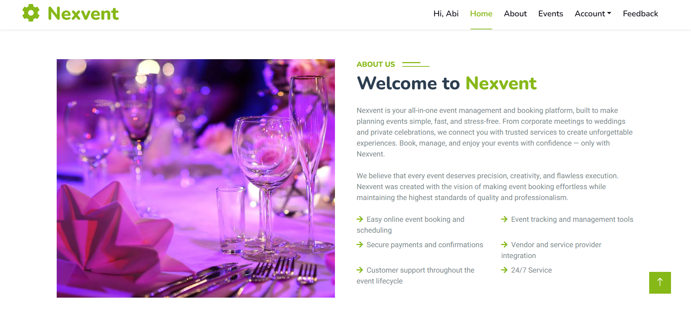
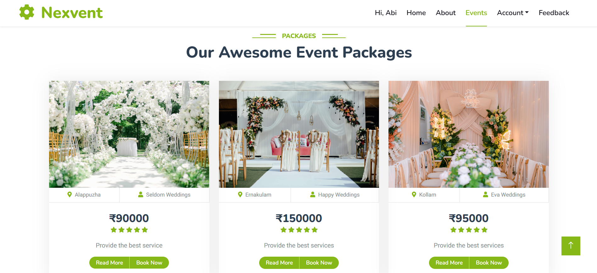
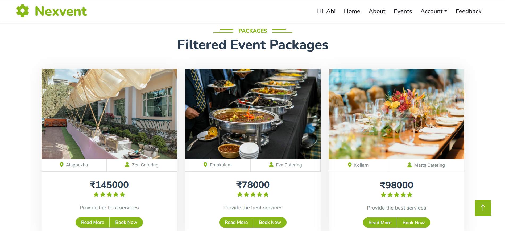
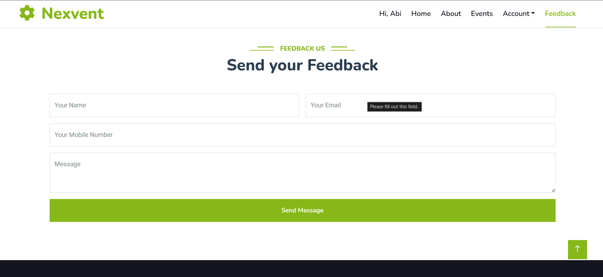
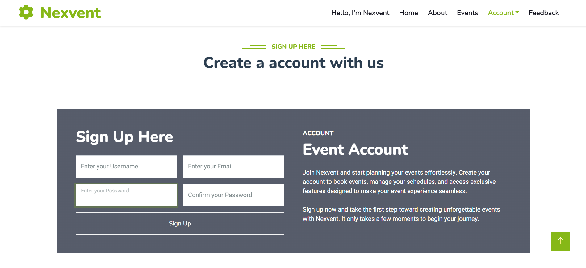
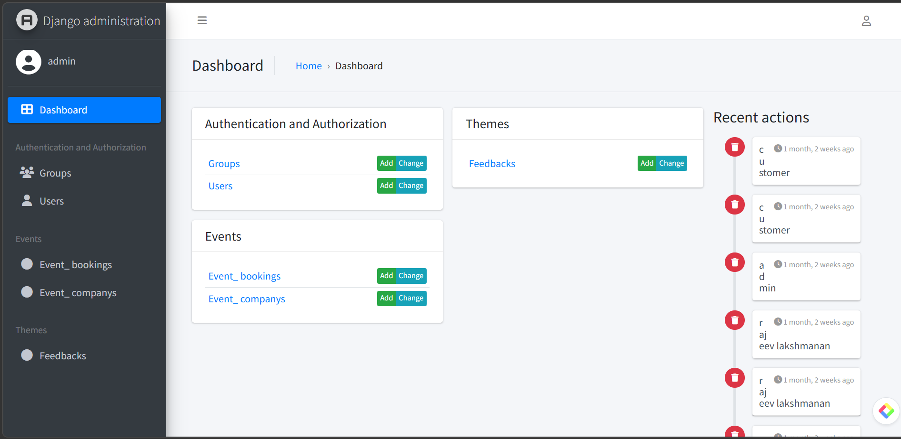
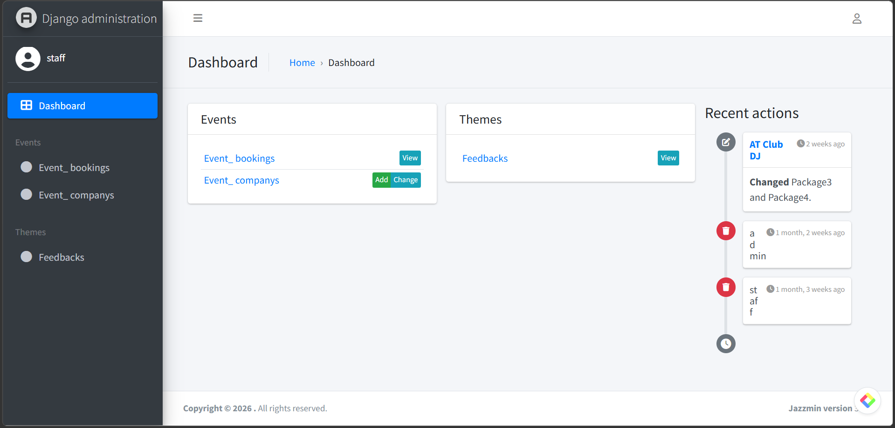

<h1 align="center">
🎉 Nexvent
</h1>

<p align="center">
<b>Full-Stack Event Management & Booking Platform Built with Django</b>
</p>

<p align="center">
Nexvent simplifies event planning by allowing users to discover, book, and manage event packages through a modern web interface with secure authentication and an intuitive admin dashboard.
</p>

<p align="center">


</p>

# 📖 About

Nexvent is a full-stack event management and booking platform developed using **Django**. It enables users to browse event packages, explore different themes, book events online, submit feedback, and manage their accounts through a clean and responsive interface.

The platform also includes dedicated **Admin** and **Staff** dashboards for managing event packages, bookings, feedback, and users efficiently.

The project follows the Django MVT architecture and demonstrates authentication, CRUD operations, session management, email verification, and role-based access control in a production-style web application.

# ✨ Features

- 🔐 User Authentication
- 📧 Email Verification
- 🎉 Event Package Management
- 🎨 Theme Management
- 📅 Online Event Booking
- 👥 User Account Management
- 💬 Feedback System
- 🔎 Package Filtering
- 📱 Responsive Design
- 🛡️ Secure Session Management
- 👨‍💼 Admin Dashboard
- 👨‍💻 Staff Dashboard
- ⚙️ Django Admin Integration
- 📂 Media Upload Support
- 🚀 Clean and Modern UI

# 🛠 Tech Stack

## Backend

- Python
- Django

## Frontend

- HTML5
- CSS3
- Bootstrap 5
- JavaScript

## Database

- SQLite

## Authentication

- Django Authentication
- Email Verification (SMTP)

## Tools

- Git
- GitHub
- Jazzmin
- VS Code

# 📂 Project Structure

```
Nexvent/
│
├── account_manager/        # User authentication and account management
├── events/                 # Event booking and package management
├── themes/                 # Theme management
├── media/                  # Uploaded images
├── screenshots/            # README screenshots
├── static/                 # CSS, JavaScript, Images
├── templates/              # HTML templates
├── Nexvent/                # Project configuration
│   ├── settings.py
│   ├── urls.py
│   └── wsgi.py
│
├── manage.py
├── requirements.txt
├── README.md
├── LICENSE
└── .env
```

# ⚙️ Installation

### 1. Clone the repository

```bash
git clone https://github.com/Aby020/Nexvent.git
```

### 2. Move into the project

```bash
cd Nexvent
```

### 3. Create a virtual environment

```bash
python -m venv .venv
```

### 4. Activate the virtual environment

Windows

```bash
.venv\Scripts\activate
```

Linux / macOS

```bash
source .venv/bin/activate
```

### 5. Install dependencies
=======
# 🎉 NEXVENT – Event Management Platform

A modern **Event Management Platform** built with **Django**, **Python**, and **MySQL** that enables users to discover, organize, and book events through a secure and user-friendly web application.


## ✨ Features

- 🔐 Secure user authentication
- 🎫 Event creation and management
- 📅 Event booking system
- 🔍 Keyword-based event search
- 👤 User profile management
- 🛠️ Admin dashboard
- 📱 Responsive user interface
- ☁️ Cloud deployment support

---

## 🛠️ Tech Stack

**Frontend**
- HTML5
- CSS3
- JavaScript

**Backend**
- Python
- Django

**Database**
- MySQL

**Tools**
- Git
- GitHub
- VS Code
- PythonAnywhere

---

## 📂 Project Structure

```
Nexvent
│
├── accounts/
├── events/
├── themes/
├── templates/
├── static/
├── media/
├── manage.py
└── requirements.txt
```

---

## 🌐 Live Demo

🚀 Experience the application online:

**🔗 https://nexvent.pythonanywhere.com/**

---

## 🚀 Getting Started

Clone the repository

```bash
git clone https://github.com/Aby020/nexvent.git
```

Navigate to the project

```bash
cd nexvent
```

Install dependencies


```bash
pip install -r requirements.txt
```


### 6. Configure environment variables

Create a `.env` file in the project root.

### 7. Apply migrations

```bash
python manage.py migrate
```

### 8. Run the development server
Run the development server


```bash
python manage.py runserver
```


Open

```
http://127.0.0.1:8000/
```

# 🔐 Environment Variables

Create a `.env` file in the project root.

```env
SECRET_KEY=your_secret_key

DEBUG=True

EMAIL_HOST=smtp.gmail.com
EMAIL_USE_TLS=True
EMAIL_PORT=587
EMAIL_HOST_USER=your_email@gmail.com
SERVER_EMAIL=your_email@gmail.com
EMAIL_HOST_PASSWORD=your_app_password
```

> **Note:** Never upload your actual `.env` file or email credentials to GitHub.


# 📸 Screenshots

## 🏠 Home Page

The landing page introduces Nexvent with an overview of the platform, featured event services, and quick navigation for users.

<p align="center">
  
</p>

---

## 🎉 Event Packages

Browse a variety of event packages including weddings, corporate events, catering, photography, and more.

<p align="center">
  
</p>

---

## 🔍 Filtered Event Packages

Users can filter event packages based on themes and categories to quickly find suitable services.

<p align="center">
  
</p>

---

## 💬 Feedback System

Users can submit valuable feedback to help improve the platform and overall customer experience.

<p align="center">
  
</p>

---

## 👤 User Registration

Simple and secure account registration with email verification for new users.

<p align="center">
  
</p>

---

## ⚙️ Admin Dashboard

The administrator dashboard provides complete control over users, event packages, themes, and feedback management.

<p align="center">
  
</p>

---

## 👨‍💼 Staff Dashboard

A dedicated staff panel for managing event packages, bookings, and customer requests with role-based permissions.

<p align="center">
  
</p>

# 🚀 Future Improvements

- 💳 Online Payment Gateway Integration
- 📱 Progressive Web App (PWA) Support
- 📍 Google Maps Integration for Event Venues
- 🤖 AI-Based Event Recommendations
- 📊 Analytics Dashboard
- 📅 Calendar Synchronization
- 🔔 Real-Time Booking Notifications
- 💬 Live Chat Support
- ⭐ Event Reviews and Ratings
- ☁️ Cloud Deployment (AWS / Azure / Render)


# 🤝 Contributing

Contributions are welcome!

If you'd like to improve Nexvent, feel free to:

1. Fork the repository
2. Create your feature branch

```bash
git checkout -b feature/NewFeature
```

3. Commit your changes

```bash
git commit -m "Add new feature"
```

4. Push to your branch

```bash
git push origin feature/NewFeature
```

5. Open a Pull Request

# 📄 License

This project is licensed under the MIT License.

See the **LICENSE** file for more information.

# 👨‍💻 Author

### Abi Thomas

Backend Developer | Python & Django Developer

📧 Email: your-email@example.com

💼 LinkedIn: https://linkedin.com/in/abithomas-dev

🐙 GitHub: https://github.com/Aby020

---

⭐ If you found this project helpful, consider giving it a **Star** on GitHub!
=======
## 💡 Future Enhancements

- Online payment integration
- Email notifications
- Event analytics dashboard
- QR code ticket verification
- Mobile application support

---

## 👨‍💻 Author

**Abi Thomas**

- GitHub: https://github.com/Aby020
- LinkedIn: https://www.linkedin.com/in/abi-thomas-39633a200

---

⭐ If you found this project interesting, consider giving it a star.

