# 🎉 Plannix — Premium Event Planning & Booking Platform

<div align="center">

A modern full-stack **Django** web application for discovering event packages, booking them online, and managing the entire lifecycle — from a customer's first browse to the admin's final confirmation — through secure authentication, role-based dashboards, and a polished, responsive interface.


</div>

## 🎬 Demo

Watch the full journey — browse, filter, book, and manage — in a few seconds:

<p align="center">
  
</p>

---

## 📖 Overview

**Plannix** is a complete event-management platform built with Django 6 and Bootstrap 5. It brings together everything needed to run an event-planning business online:

- **Customers** browse a curated catalogue of event packages, read full details, and book their event in a few clicks — then track and cancel bookings from their own dashboard.
- **Staff** manage the catalogue and process bookings from a dedicated operational dashboard.
- **Admins** get the full picture — revenue, booking health, user management, feedback moderation — plus a branded Django administration panel.

The project demonstrates production-minded Django: role-based access control, session timeout handling, custom error pages, a seeded demo dataset, and a complete automated test suite (60+ tests) — all wrapped in a custom design system with its own tokens, components, and animations.

Whether it's a grand wedding, a corporate summit, or a sunset beach proposal, Plannix provides a streamlined digital workflow for customers, staff, and administrators.

---

## ✨ Key Features

### 🔐 Authentication & Role-Based Access
- Secure sign-up and sign-in with validation (duplicate usernames/emails, password mismatch, Django password validators)
- Three roles — **Admin**, **Staff**, **Customer** — enforced at the view level via `login_required` and group checks
- Session timeout after 30 minutes of inactivity, auto-expiry on browser close
- Profile editing and password change with old-password verification

### 🎉 Event Catalogue & Booking
- Browse a 20-package catalogue across 5 categories — Birthday, Catering, Corporate, DJ, and Wedding
- Search by keyword and filter by event type
- Rich event detail pages with description, pricing, location, and package inclusions
- Online booking form with server-side validation: no past dates, 10-digit mobile numbers, and conflict detection for already-booked dates
- Instant booking confirmation page

### 🖥️ Role-Based Dashboards
- **Customer dashboard** — upcoming bookings, spend summary, recent activity
- **Staff dashboard** — operational overview and catalogue management
- **Admin dashboard** — revenue, booking counts, user counts, event breakdowns, recent bookings, latest feedback

### 📊 Management Suite
- **Events** — add, edit, delete event packages
- **Bookings** — status filter, update status (pending → confirmed / completed / cancelled), delete
- **Feedback** — review and moderate customer feedback
- **Users** — activate/deactivate accounts, delete users (with self-protection guards)

### 📧 Feedback & Communication
- Public feedback form
- Feedback moderation in the admin dashboard
- Email wiring via environment variables (console backend in development)

### 🔒 Security
- Django authentication + session management
- Deny-by-default authorization (decorators and group checks on every protected route)
- Environment-variable configuration — no secrets in code
- Custom 404 / 403 / 500 error pages
- Clickjacking, XSS, and content-type protections configured

### 🎨 User Experience
- Custom design system: indigo → violet gradient, Inter + Sora typography, rounded glass cards
- Scroll-reveal animations, hover lifts, and micro-interactions
- Fully responsive — mobile sidebar with overlay, fluid grids, touch-friendly controls
- Branded Jazzmin Django admin panel

---

## 📸 Screenshots

### 🏠 Catalogue & Browsing

Browse the full catalogue, filter by event type, and learn about Plannix.

**Event catalogue with the Birthday filter applied** — 4 packages, type pills, and keyword search:

<p align="center">
  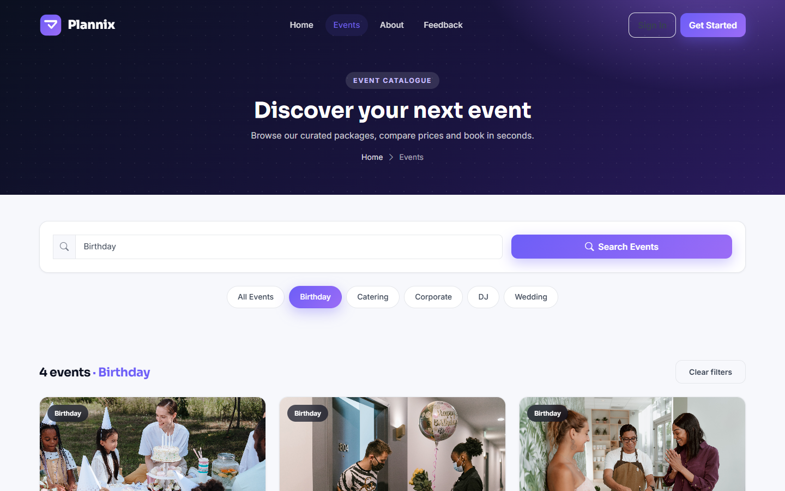
</p>

**The complete catalogue** across all event types:

<p align="center">
  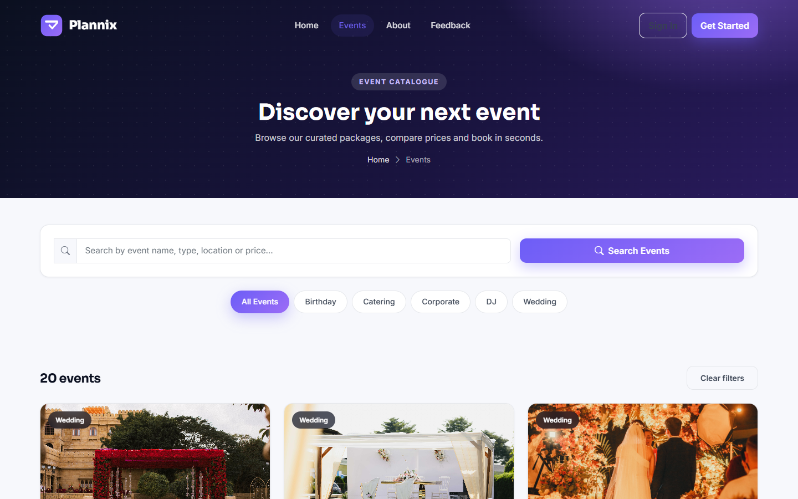
</p>

**Our Mission section** — what Plannix stands for:

<p align="center">
  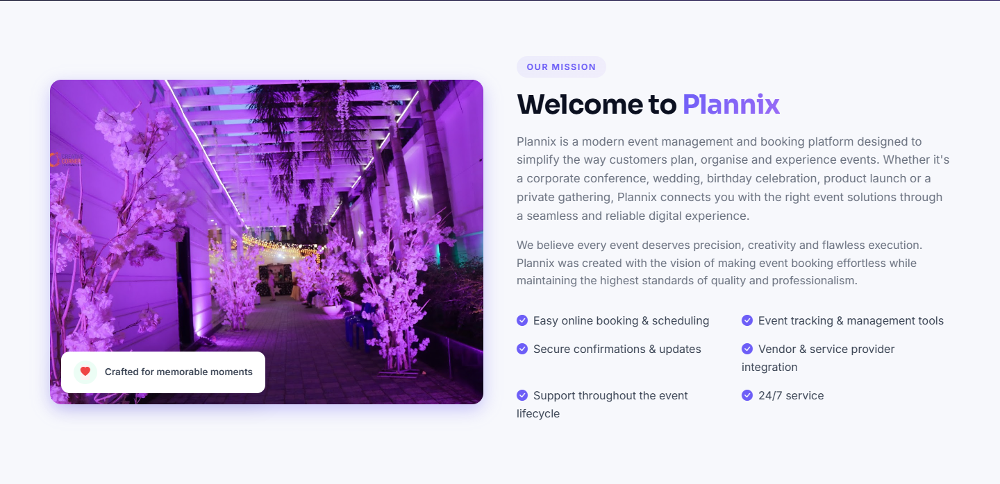
</p>

**The About page**, end to end:

<p align="center">
  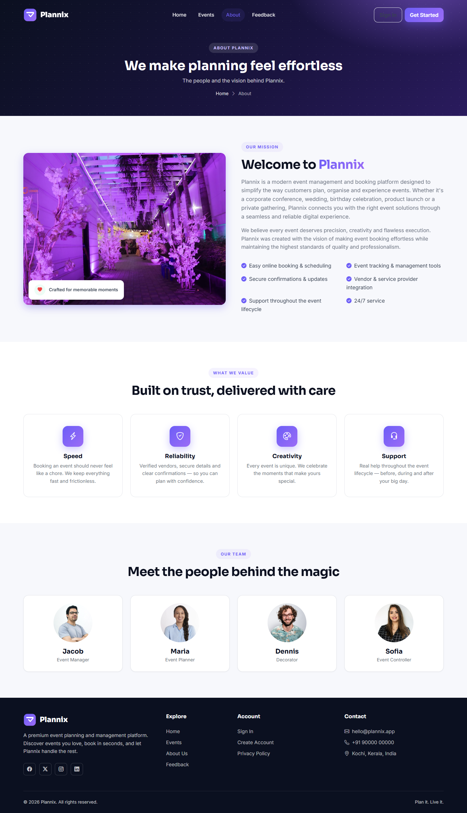
</p>

---

### 🛒 Booking Flow

From a few clicks on the booking form to instant confirmation.

**The booking form**, pre-filled for a signed-in customer:

<p align="center">
  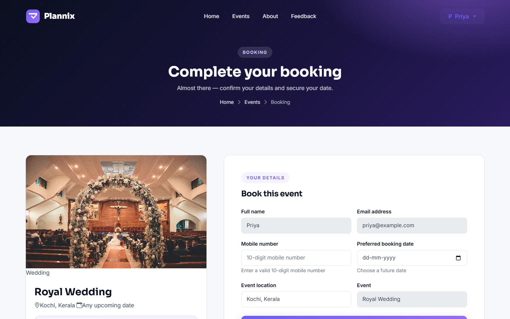
</p>

**Booking confirmation** — instant feedback after submission:

<p align="center">
  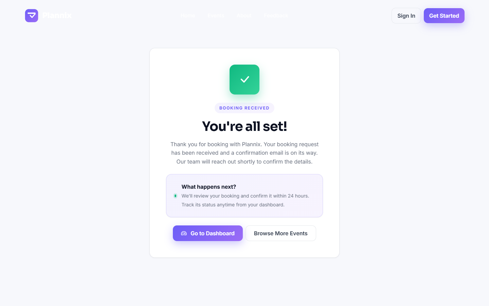
</p>

---

### 🔐 Authentication

Sign-in and sign-up with validation and a polished brand look:

<p align="center">
  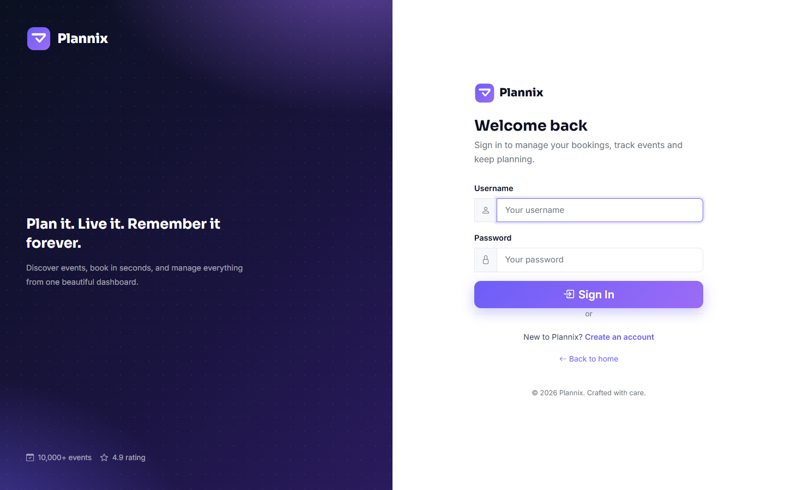
  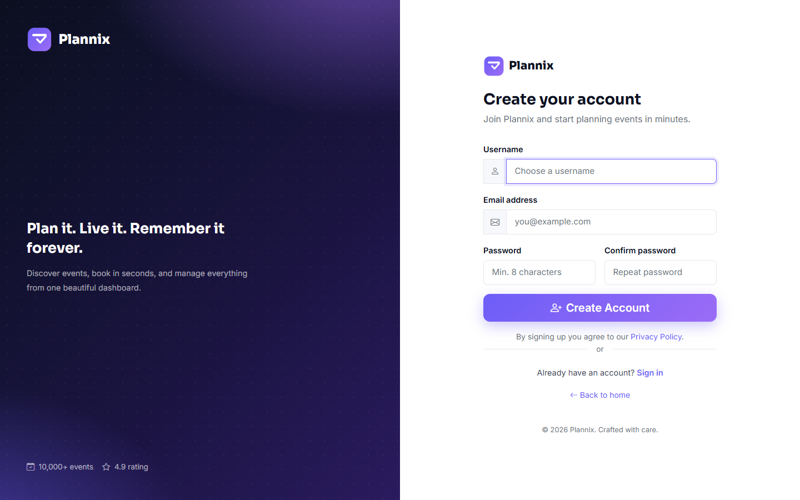
</p>

---

### 💬 Feedback

Customers can share their experience through a clean form:

<p align="center">
  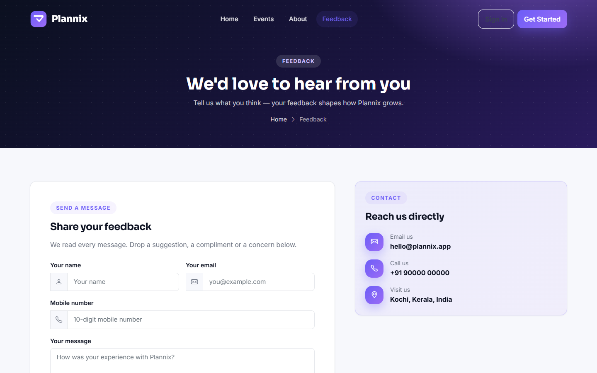
</p>

---

### 🖥️ Dashboards

Each role gets its own operational view.

**Customer dashboard** — upcoming bookings, spend, and recent activity:

<p align="center">
  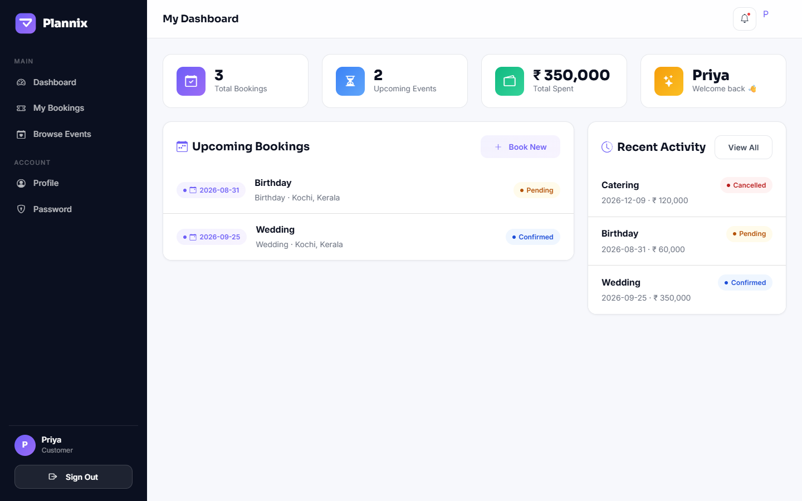
</p>

**Staff dashboard** — the operational view staff use to keep the platform moving:

<p align="center">
  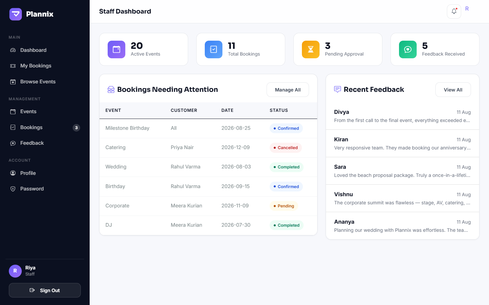
</p>

**Admin dashboard** — revenue, bookings, users, event types, and recent activity at a glance:

<p align="center">
  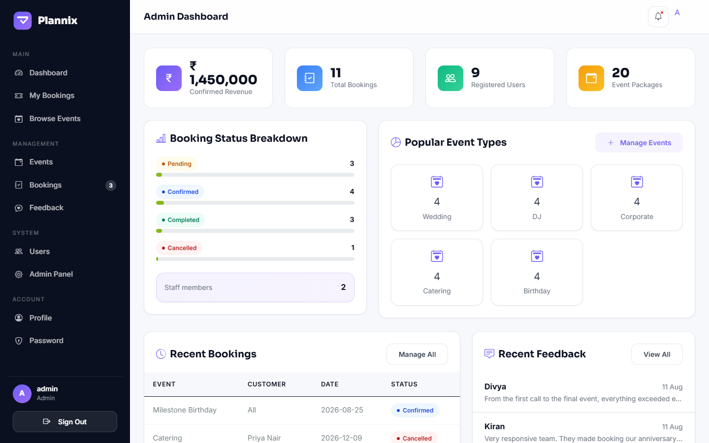
</p>

---

### 🗂️ Management Suite

Moderate the platform — events and feedback, staffed by staff & admins.

**Manage events** — add, edit, and remove packages:

<p align="center">
  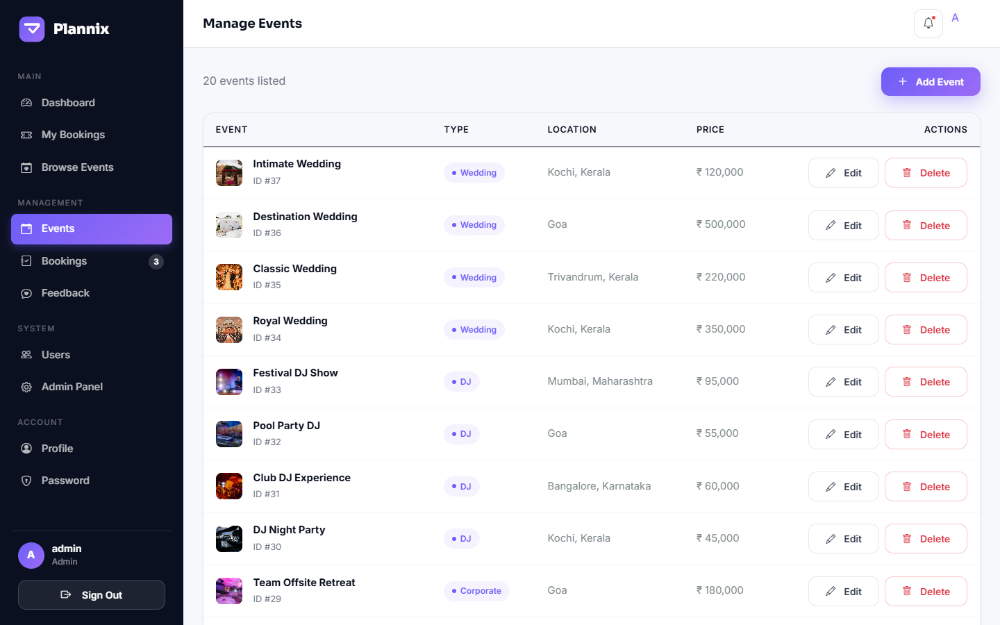
</p>

**Manage feedback** — review and moderate customer feedback:

<p align="center">
  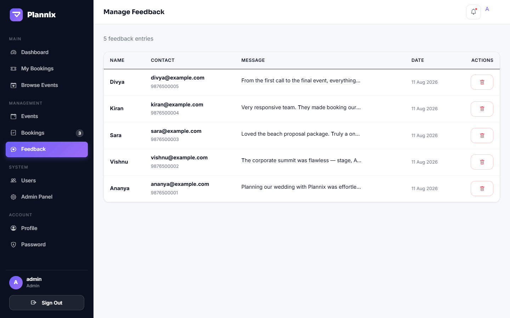
</p>

---

## 🧑‍🤝‍🧑 User Roles

| Capability | Customer | Staff | Admin |
|------------|:--------:|:-----:|:-----:|
| Browse catalogue & search | ✅ | ✅ | ✅ |
| Book an event | ✅ | ✅ | ✅ |
| View / cancel own bookings | ✅ | ✅ | ✅ |
| Edit own profile / password | ✅ | ✅ | ✅ |
| Manage event packages | — | ✅ | ✅ |
| Update booking statuses | — | ✅ | ✅ |
| Moderate feedback | — | ✅ | ✅ |
| Manage users (activate / delete) | — | — | ✅ |
| Revenue & platform overview | — | — | ✅ |
| Django admin panel | — | — | ✅ |

---

## 🛠️ Technology Stack

| Category | Technology |
|----------|-----------|
| **Backend** | Python 3.13, Django 6.0.1 |
| **Frontend** | HTML5, CSS3, Bootstrap 5.3.3, Bootstrap Icons, vanilla JavaScript |
| **Database** | SQLite3 |
| **Authentication** | Django auth + group-based roles |
| **Admin panel** | Django admin + Jazzmin (branded) |
| **Email** | SMTP via environment variables (console backend in dev) |
| **Sessions** | django-session-timeout (30 min inactivity expiry) |
| **Media** | Pillow (image handling) |
| **Config** | django-environ (`.env` file) |
| **Quality** | 60+ Django tests, custom error handlers |

---

## 🏗️ Architecture

```text
                        Client Browser
                              │
                              ▼
                     Bootstrap 5 + Custom CSS
                              │
                              ▼
                      Django URL Routing
                              │
            ┌─────────────────┼─────────────────┐
            ▼                 ▼                 ▼
   account_manager        events             themes
   (sign-up, sign-in,   (catalogue, booking,  (home, about,
    profile, password)   dashboards, manage)   feedback)
            │                 │                 │
            └─────────────────┼─────────────────┘
                              ▼
                        SQLite Database
                              │
                        (models: User, Group,
                    Event_Company, Event_Booking,
                          Feedback)
```

---

## 📂 Project Structure

```text
Plannix/
│
├── Plannix/                 # Django project configuration
│   ├── settings.py          # apps, middleware, auth, jazzmin, security
│   ├── urls.py              # root routing + custom error handlers
│   └── context_processors.py# shared site-wide context
│
├── account_manager/         # Authentication & profile management
│   ├── urls.py              # sign-up / sign-in / sign-out / profile / change-password
│   ├── views.py
│   └── tests.py             # 21 auth tests
│
├── events/                  # Core business module
│   ├── models.py            # Event_Company, Event_Booking
│   ├── urls.py              # catalogue, booking, dashboards, management
│   ├── views.py
│   ├── tests.py             # 48 tests
│   └── management/commands/
│       └── seed_demo.py     # idempotent demo-data seeder
│
├── themes/                  # Public pages & feedback
│   ├── models.py            # Feedback
│   ├── urls.py              # index / about / feedback / success / privacy-policy
│   └── views.py
│
├── templates/               # Django templates (public + dashboard)
├── static/                  # CSS, JS, fonts & imagery
│   └── css/style.css        # full design system
├── media/                   # Uploaded event images
├── event_images/            # Seed-source images by category
├── screenshots/             # README screenshots & demo GIF
├── scripts/                 # Tooling (screenshot capture, etc.)
│
├── manage.py
├── requirements.txt
├── README.md
└── .env                     # local secrets — never committed
```

---

## 🚀 Getting Started

### Prerequisites

- **Python 3.12+** (developed on 3.13)
- Git

### 1️⃣ Clone & enter the project

```bash
git clone https://github.com/Aby020/Plannix.git
cd Plannix
```

### 2️⃣ Create a virtual environment

**Windows**

```powershell
python -m venv venv
venv\Scripts\activate
```

**Linux / macOS**

```bash
python3 -m venv venv
source venv/bin/activate
```

### 3️⃣ Install dependencies

```bash
pip install -r requirements.txt
```

### 4️⃣ Configure the environment

Create a `.env` file in the project root. Copy the shape below and fill in your own values — **never commit real credentials**.

```env
SECRET_KEY=your-long-random-secret-key
DEBUG=True
ALLOWED_HOSTS=127.0.0.1,localhost

# SMTP — the app password stays in .env only
EMAIL_HOST=smtp.gmail.com
EMAIL_PORT=587
EMAIL_USE_TLS=True
EMAIL_HOST_USER=you@gmail.com
EMAIL_HOST_PASSWORD=your-app-password
SERVER_EMAIL=you@gmail.com
```

> In development the email backend is `console.EmailBackend`, so outbound mail is printed to the terminal — no SMTP account is required to try the app.

### 5️⃣ Apply migrations

```bash
python manage.py migrate
```

### 6️⃣ (Optional) Seed demo data

Populates the app with 3 roles, 6 users, 20 event packages (5 categories × 4 events), 10 bookings, and 5 feedback entries — everything you need to explore every role immediately.

```bash
python manage.py seed_demo
```

Demo accounts:

| Role | Username | Password |
|------|----------|----------|
| Admin | `admin` | set via `PLANNIX_ADMIN_PASSWORD` (random & printed if unset) |
| Staff | `staff1` | `staffpass123` |
| Customer | `priya` / `arjun` / `meera` / `rahul` | `customer123` |

### 7️⃣ Create a superuser (if you skipped seeding)

```bash
python manage.py createsuperuser
```

---

## 🧭 Running the App

```bash
python manage.py runserver 8009
```

Then open:

| Destination | URL |
|-------------|-----|
| Public site | `http://127.0.0.1:8009/` |
| Django admin | `http://127.0.0.1:8009/core-admin/` |

### Route Map

**Public**

| Route | View | Notes |
|-------|------|-------|
| `/` | index | Home page |
| `/events` | events | Catalogue with type filter |
| `/readmore/<id>` | readmore | Event detail |
| `/search?q=` | searching_events | Keyword search |
| `/about` | about | About Plannix |
| `/feedback` | feedback | Public feedback form |
| `/privacy-policy` | privacy_policy | Policy page |

**Authentication**

| Route | View | Notes |
|-------|------|-------|
| `/sign-up` | sign_up | Registration |
| `/sign-in` | sign_in | Login |
| `/sign-out` | sign_out | Logout |
| `/profile` | profile | Edit profile (login required) |
| `/change-password` | change_password | Change password (login required) |

**Booking**

| Route | View | Notes |
|-------|------|-------|
| `/event-booking-form/<id>` | selected_event | Booking form (login required) |
| `/event-booking-form` | event_booking | Submit booking |
| `/success` | success | Confirmation page |

**Dashboards & customer area**

| Route | View | Notes |
|-------|------|-------|
| `/dashboard` | dashboard | Role-aware redirect |
| `/customer-dashboard` | customer_dashboard | Customer view |
| `/staff-dashboard` | staff_dashboard | Staff only |
| `/admin-dashboard` | admin_dashboard | Admin only |
| `/my-bookings` | my_bookings | Own bookings only |
| `/cancel-booking/<id>` | cancel_booking | Cancel own pending booking |

**Management**

| Route | View | Access |
|-------|------|-------|
| `/manage/events` (+ add / edit / delete) | manage suite | Staff + Admin |
| `/manage/bookings` (+ status / delete) | manage suite | Staff + Admin |
| `/manage/feedback` (+ delete) | manage suite | Staff + Admin |
| `/manage/users` (+ toggle / delete) | manage suite | Admin only |
| `/core-admin/` | Django admin | Staff (superuser) |

---

## 🔧 Environment Variables

| Variable | Description |
|----------|-------------|
| `SECRET_KEY` | Django secret key (required) |
| `DEBUG` | `True` in development, `False` in production |
| `ALLOWED_HOSTS` | Comma-separated allowed hosts |
| `EMAIL_HOST` | SMTP server address |
| `EMAIL_PORT` | SMTP server port |
| `EMAIL_USE_TLS` | Enable TLS for SMTP |
| `EMAIL_HOST_USER` | SMTP account |
| `EMAIL_HOST_PASSWORD` | SMTP app password |
| `SERVER_EMAIL` | Sender address |

---

## 🧪 Running the Tests

The project ships with a comprehensive test suite covering authentication, the public catalogue, the booking flow (validation & conflicts), customer dashboards, staff management, admin management, and the custom error handlers.

```bash
python manage.py test
```

To run a single app:

```bash
python manage.py test account_manager
python manage.py test events
```

---

## 🔮 Future Improvements

Planned enhancements for future releases:

- 💳 Online payment gateway integration
- 📱 Real-time booking notifications (email/SMS)
- 📅 Event calendar & availability view
- ⭐ Customer ratings & reviews
- 🗺️ Venue maps integration
- 🤖 AI-based event recommendations
- 🐳 Docker deployment
- 🐘 PostgreSQL production database
- 🌐 REST API (DRF) for mobile clients

---

## 🛡️ Security Notes

- Secrets are read from `.env` only; nothing is committed with real values.
- `SESSION_COOKIE_SECURE`, `CSRF_COOKIE_SECURE`, and `SECURE_SSL_REDIRECT` default to off for local development — flip them on behind TLS in production.
- HSTS is pre-configured (1 year) — enable `SECURE_HSTS_PRELOAD` once you own the domain.
- Authorization is deny-by-default: every protected view is guarded by `login_required` plus a role check; admin-only endpoints reject staff and customers.

---

## 📄 License

This project is licensed under the MIT License. See the **LICENSE** file for details.

---

## 👨‍💻 Author

<div align="center">

### Abi Thomas

**Backend Developer | Python & Django Developer**

Passionate about building scalable backend systems, modern web applications, and developer-friendly software using Python and Django.

<p>

<a href="https://github.com/Aby020">

</a>

<a href="https://linkedin.com/in/abithomas-dev">

</a>

</p>

</div>

---

## ⭐ Support

If you found this project helpful, please consider giving it a ⭐ on GitHub. Your support motivates continued development and improvement.
