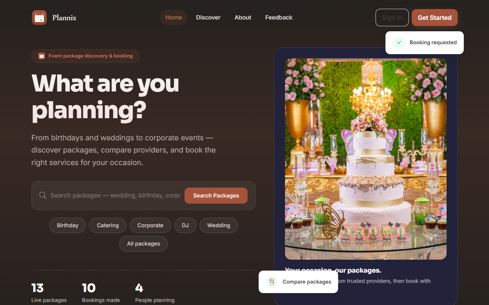
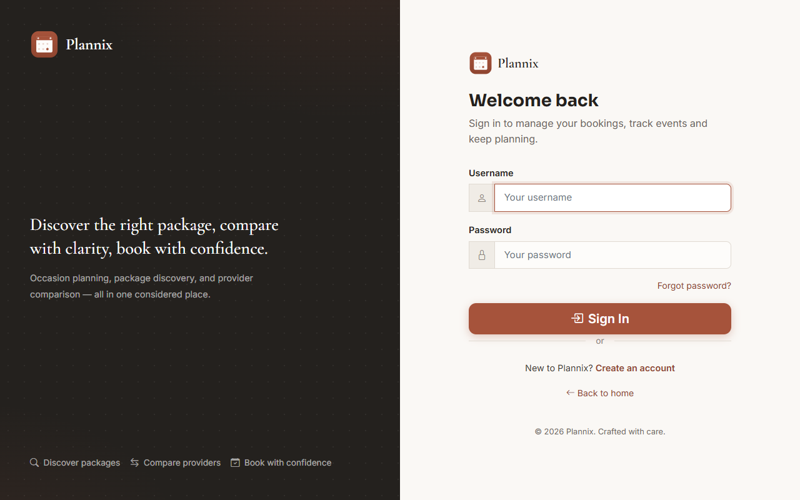
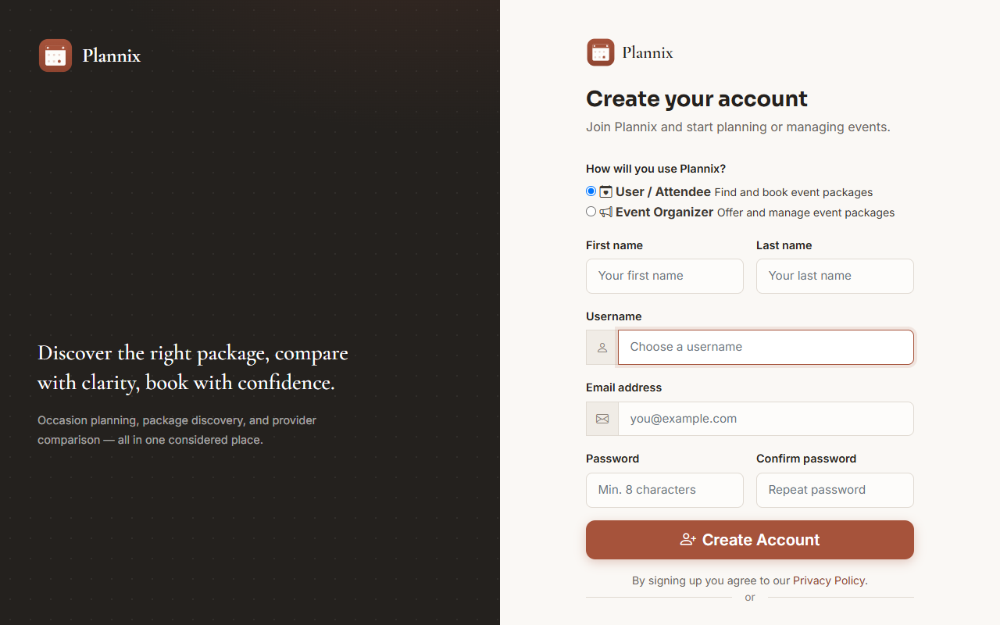
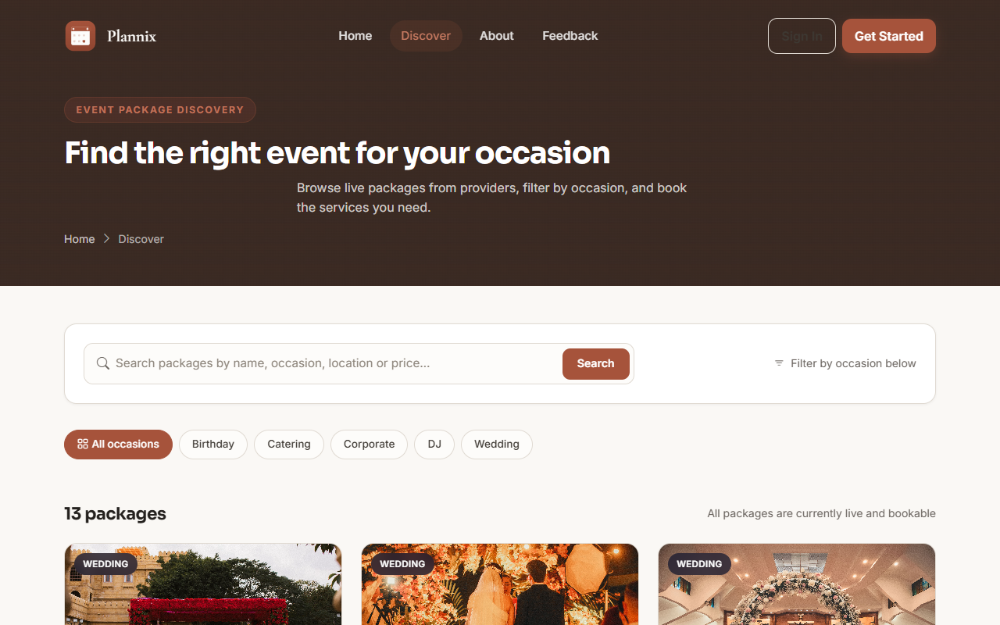
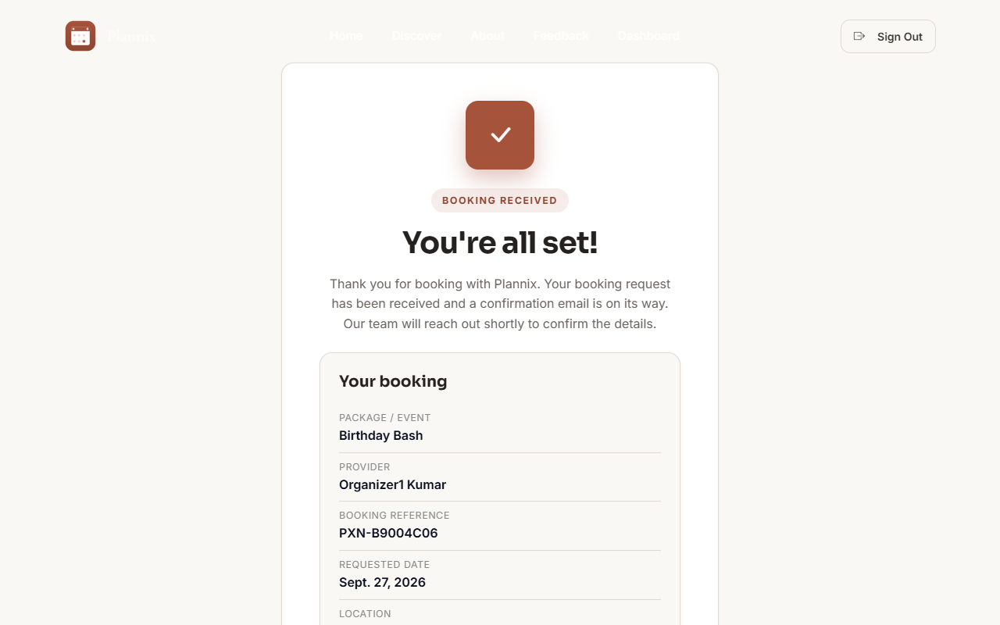
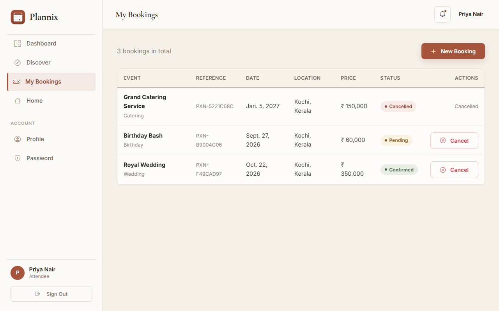
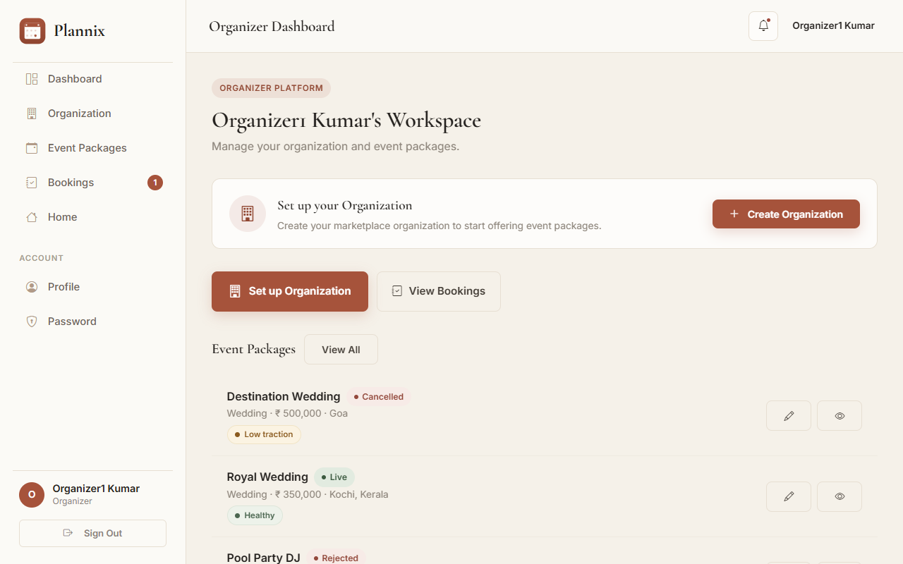
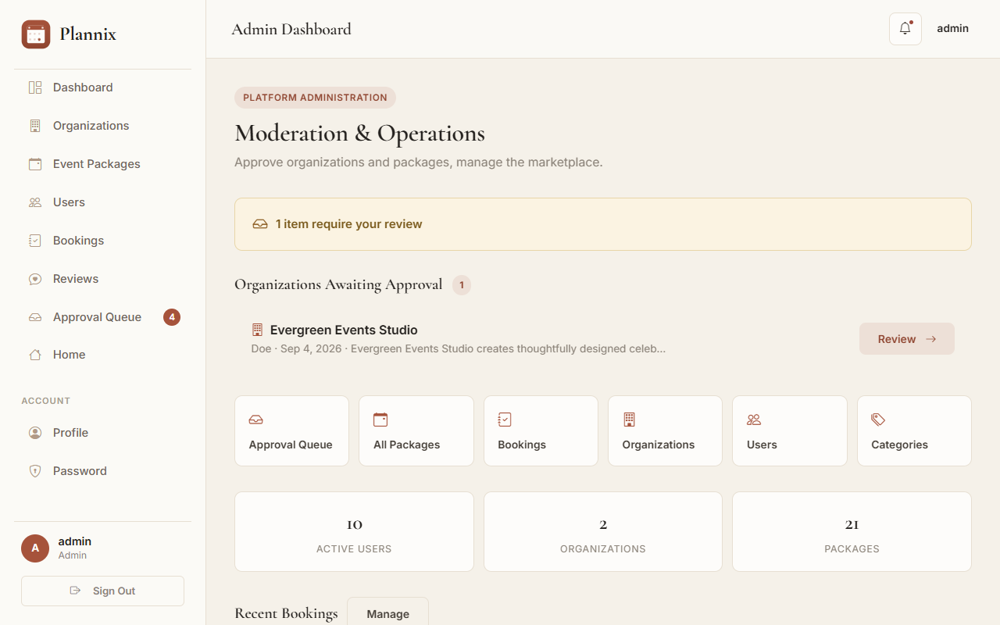
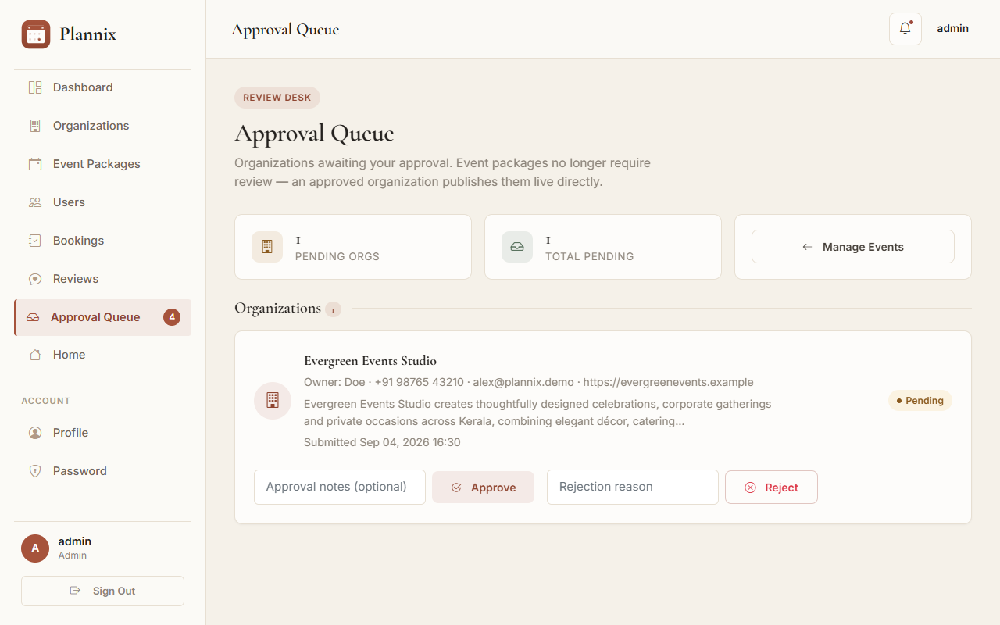

# Plannix — Event Planning & Management Platform

<div align="center">

A Django-based event planning and discovery platform where attendees discover and book live events, organizers manage organizations and events, and admins control approval and publishing.


**[Live Demo](https://plannix-0to5.onrender.com)**

</div>

---

## Features

### Attendee

- Browse and search live events by name, category, or keyword
- Filter by occasion (wedding, birthday, corporate, etc.)
- View event details with inclusions, capacity, and pricing
- Request bookings for a selected date
- Track booking status from a personal dashboard
- Submit 1–5 star reviews

### Event Organizer

- Set up and manage an organization
- Organization approval workflow (single marketplace gate)
- Create and manage events with lifecycle states
- Submit events for admin review
- View and manage bookings for own events
- Event Pulse health indicators (healthy, high_demand, low_traction, cancellation_warning)
- Organizer dashboard with stats and quick actions

### Admin

- Organization approval/rejection
- User and category management
- Event review, approval, and go-live control
- Booking management across the platform
- Review moderation (pending / approved / hidden)
- Platform statistics and admin dashboard
- Organization approval queue

### Platform

- Full event lifecycle with audit logging (`EventAuditLog`)
- Event Pulse health monitoring
- Email notifications via Resend (HTTPS backend) in production, console locally
- Cloudinary media storage in production
- PostgreSQL (Neon) in production, SQLite locally
- Razorpay advance-payment infrastructure (server-side 30% calculation, HMAC signature verification, webhook handling) — **currently dormant in the active customer booking flow**
- Health endpoint at `/health/`
- WhiteNoise static file serving in production

---

## Tech Stack

| Layer | Technology |
|-------|-----------|
| Language | Python 3.13 |
| Framework | Django 6.0.1 |
| Frontend | Bootstrap 5.3 (static CSS + CDN JS), server-rendered Django templates |
| Production Database | PostgreSQL (Neon) |
| Local Database | SQLite |
| Media Storage | Cloudinary |
| Static Files | WhiteNoise (compressed, cache-busted) |
| Email | Resend HTTPS backend (production), console backend (local) |
| Payments | Razorpay infrastructure (dormant) |
| Admin Panel | Jazzmin-branded Django admin (`/core-admin/`) |
| WSGI Server | Gunicorn (production) |
| Hosting | Render |

---

## Roles & Permissions

Plannix enforces three roles through Django Groups and view-level decorators:

| Role | Description |
|------|-------------|
| **Admin** | Full platform control — approval, moderation, user management, statistics |
| **Event Organizer** | Manages an organization, creates events, handles bookings |
| **Attendee** | Discovers events, requests bookings, submits reviews |

Roles are enforced via `@admin_required`, `@organizer_required`, and `@login_required` decorators. Unauthenticated users can browse public pages (home, discover, event details).

---

## How Plannix Works

1. **Attendee discovers a live event** — browse the public catalogue, filter by occasion, or search by keyword.
2. **Event organizers operate through an Organization** — every organizer belongs to an organization.
3. **Organization approval is the marketplace gate** — an admin must approve the organization before its events go live.
4. **Organizer creates events** — each event has a lifecycle, pricing, capacity, and inclusions.
5. **Events move through lifecycle states** — `draft` → `under_review` → `approved` → `published` → `live`, and can later become `completed` or `cancelled`.
6. **Only live events appear publicly** in the discover catalogue.
7. **Attendee requests a booking** for a chosen date.
8. **Booking receives a `PXN-xxxxxxxx` reference** — a unique tracking identifier.
9. **Organizer accepts or cancels the request** from the organizer dashboard.
10. **Attendee receives status updates by email** at each stage.

> Plannix manages **dynamic events** with full lifecycle control — not a static catalogue.

---

## Event Lifecycle

```
 ┌────────┐    ┌───────────────┐    ┌──────────┐    ┌───────────┐    ┌──────┐
 │ draft  │───▶│ under_review  │───▶│ approved │───▶│ published │───▶│ live │
 └────────┘    └───────────────┘    └──────────┘    └───────────┘    └──────┘
                    │                    │                                 │
                    ▼                    ▼                                 ▼
              ┌──────────┐        ┌──────────┐                     ┌────────────┐
              │ rejected │        │ cancelled│                     │ completed  │
              └──────────┘        └──────────┘                     └────────────┘
                    │
                    ▼
              ┌───────────┐
              │ resubmit  │
              └───────────┘
```

Transitions are controlled by the event service layer (`events/services.py`) and every transition is recorded in `EventAuditLog`.

---

## Booking Flow

1. **Live-event requirement** — only events with `status=live` accept bookings.
2. **Selected event date** — attendee picks a specific date for the event.
3. **Past-date validation** — bookings for past dates are rejected.
4. **Capacity protection** — `select_for_update` row-level locking prevents overbooking.
5. **Duplicate-booking guard** — one active booking per attendee per event.
6. **Transactional creation** — booking is created atomically with capacity decrement.
7. **PXN reference** — each booking gets a unique `PXN-xxxxxxxx` identifier.
8. **Email notifications** — attendee and organizer receive confirmation emails.
9. **Organizer confirmation** — organizer accepts or cancels the booking request.

> For payment details, please contact the event organizer directly.

---

## Reviews & Event Pulse

### Reviews

- 1–5 star rating system
- Moderation states: `pending` → `approved` / `hidden`
- Linked to completed or live events

### Event Pulse

Event Pulse computes real-time health for each event based on bookings, reviews, and engagement:

| Health State | Meaning |
|-------------|---------|
| `healthy` | Normal booking activity |
| `high_demand` | Booking volume exceeds capacity threshold |
| `low_traction` | Few or no bookings relative to event age |
| `cancellation_warning` | High cancellation rate detected |

---

## Security & Authentication

- Custom registration and sign-in (no third-party auth)
- Role-based access enforced via Django Groups and decorators
- Sign-in throttling (rate limiting on login attempts)
- Session fixation prevention
- POST-only logout
- All four Django password validators enabled
- Password reset flow
- 30-minute session timeout with activity-based renewal
- `HttpOnly` and `SameSite=Lax` cookies
- Production secure-cookie configuration (`SESSION_COOKIE_SECURE`, `CSRF_COOKIE_SECURE`)
- HSTS, SSL redirect, and security headers configurable via environment
- Razorpay HMAC signature verification on payment webhooks

---

## Demo Data

The `seed_demo` management command populates the platform with representative data:

```bash
python manage.py seed_demo
```

This creates:

- **Users** — admin, event organizers, and attendees with demo credentials
- **Categories** — occasion types (wedding, birthday, corporate, etc.)
- **Events** — across lifecycle states (draft, under review, approved, published, live, completed, cancelled, rejected)
- **Organizations** — with approval states
- **Bookings** — with various statuses (pending, confirmed, completed, cancelled)
- **Reviews** — sample ratings
- **Audit logs** — event lifecycle transition history

---

## Quick Start

### Prerequisites

- Python 3.13
- pip

### Setup

```bash
# Clone the repository
git clone https://github.com/Aby020/Plannix.git
cd Plannix

# Create and activate virtual environment
python -m venv venv
# Windows:
venv\Scripts\activate
# macOS/Linux:
source venv/bin/activate

# Install dependencies
pip install -r requirements.txt

# Configure environment variables
# Create a .env file with at minimum:
#   SECRET_KEY=<your-secret-key>
#   DEBUG=True

# Run migrations
python manage.py migrate

# Seed demo data
python manage.py seed_demo

# Start the development server
python manage.py runserver
```

The application runs at `http://127.0.0.1:8000` by default.

---

## Project Structure

```
Plannix/
├── Plannix/                 # Project configuration
│   ├── settings.py          # Django settings
│   ├── urls.py              # Root URL routing
│   ├── emails.py            # Email sending utilities
│   ├── email_backends.py    # Resend HTTPS email backend
│   └── wsgi.py              # WSGI entry point
├── events/                  # Core event & booking app
│   ├── models.py            # Event, EventBooking, Review, EventAuditLog
│   ├── views.py             # All event, booking, and admin views
│   ├── urls.py              # Event URL patterns
│   ├── forms.py             # Event and booking forms
│   ├── services.py          # Event lifecycle transitions (VALID_TRANSITIONS)
│   ├── booking.py           # Booking creation with row-level locking
│   ├── payments.py          # Razorpay payment infrastructure
│   └── pulse.py             # Event Pulse health computation
├── account_manager/         # Auth & organization management
│   ├── models.py            # OrganizerProfile, Organization
│   ├── views.py             # Registration, sign-in, dashboard views
│   ├── decorators.py        # @admin_required, @organizer_required
│   └── services.py          # Organization approval logic
├── themes/                  # Themes & feedback app
│   ├── models.py            # Theme, ThemeVariant, Feedback
│   └── views.py             # Theme catalog views
├── templates/               # Django HTML templates
├── static/                  # CSS, JavaScript, images
├── media/                   # User-uploaded media (local dev)
├── screenshots/             # README screenshot gallery
├── scripts/                 # Utility scripts
└── manage.py                # Django management
```

---

## Routes

| Route | Description |
|-------|-------------|
| `/` | Home page — hero, categories, featured events |
| `/events` | Discover catalogue — browse/search live events |
| `/readmore/<id>` | Event detail page |
| `/event-booking-form/<id>` | Booking request form |
| `/sign-in` | Sign in |
| `/sign-up` | Create account |
| `/my-bookings` | Attendee booking dashboard |
| `/organizer-dashboard` | Organizer workspace |
| `/admin-dashboard` | Admin platform overview |
| `/admin/approval-queue` | Organization approval queue |
| `/admin/approve/<id>` | Approve organization |
| `/admin/reject/<id>` | Reject organization |
| `/admin/publish/<id>` | Publish event |
| `/admin/go-live/<id>` | Set event live |
| `/payments/<id>/initiate` | Razorpay payment initiation (dormant) |
| `/payments/verify` | Razorpay signature verification (dormant) |
| `/payments/webhook` | Razorpay webhook handler (dormant) |
| `/health/` | Health check endpoint |
| `/core-admin/` | Jazzmin-branded Django administration |

---

## Screenshots

<div align="center">

<table>
<tr>
<td align="center"><strong>Home</strong><br></td>
<td align="center"><strong>Sign In</strong><br></td>
</tr>
<tr>
<td align="center"><strong>Create Account</strong><br></td>
<td align="center"><strong>Discover</strong><br></td>
</tr>
<tr>
<td align="center"><strong>Booking Confirmation</strong><br></td>
<td align="center"><strong>My Bookings</strong><br></td>
</tr>
<tr>
<td align="center"><strong>Organizer Dashboard</strong><br></td>
<td align="center"><strong>Admin Dashboard</strong><br></td>
</tr>
<tr>
<td colspan="2" align="center"><strong>Approval Queue</strong><br></td>
</tr>
</table>

</div>

---

## Deployment

**Production:** [https://plannix-0to5.onrender.com](https://plannix-0to5.onrender.com)

| Service | Provider |
|---------|----------|
| Hosting | Render (Gunicorn) |
| Database | PostgreSQL via Neon |
| Media | Cloudinary |
| Email | Resend (HTTPS backend) |
| Static Files | WhiteNoise |

Environment variables switch between local development and production services — no code changes required. Set `DATABASE_URL`, `USE_CLOUDINARY`, `USE_WHITENOISE`, `EMAIL_BACKEND`, and `RESEND_API_KEY` in your production environment.

---

## Roadmap

- **Activate Razorpay advance-payment flow** — the infrastructure is implemented (server-side 30% calculation, signature verification, webhook handling) but currently dormant in the customer booking journey.
- **Establish automated test baseline** — the current verified test count is 0.

---

## License

This project is licensed under the [CC0 1.0 Universal](LICENSE) license.
